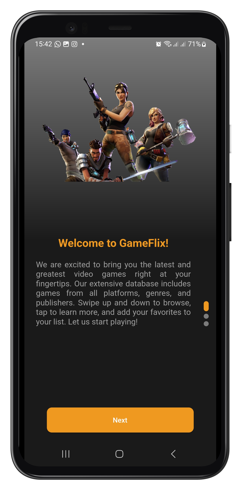
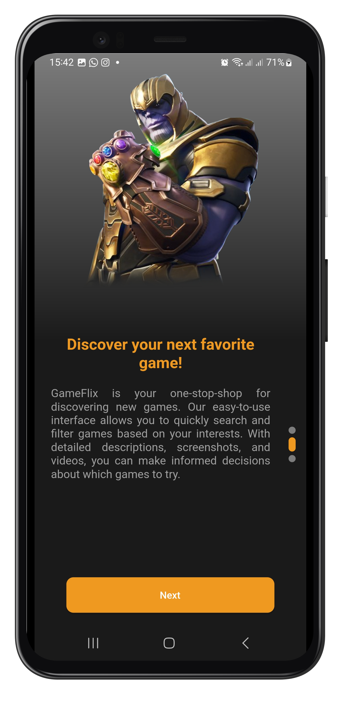
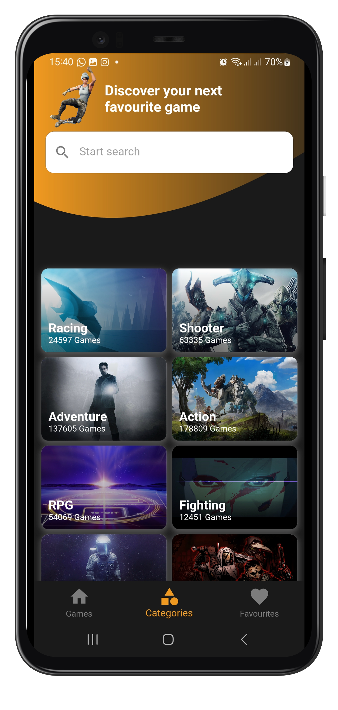
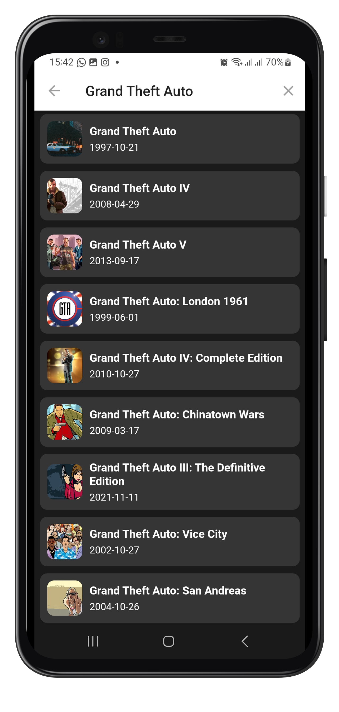
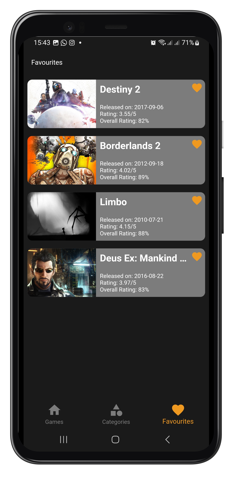
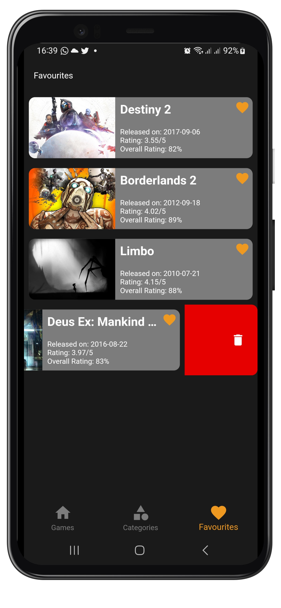

# GamesNation

This App Is Built With Flutter And It Uses [RAWG API](https://rawg.io) To Fetch Multiplatform Games And Display Them To The Users And It Uses BLOC As a State Management Tool And GetIt for Dependenct Injection.

## Getting Started

To run this project, 
- You need to have Flutter installed on your machine. You can find the installation guide [here](https://flutter.dev/docs/get-started/install).
- Clone this repository
- In order to be able to build the application you'll need to change the api key in `contants.dart`. First and formost you need to generate your own api key by [creating](https://rawg.com/Identity/Account/Manage) an RAWG account and [generating](https://rawg-api.com/api) an api key.
- Run `flutter pub get` to install all the dependencies
- Run `flutter pub run build_runner build ` to generate the files for floor database
- Run `flutter pub run flutter_launcher_icons:main && flutter pub run flutter_native_splash:create`
- Run `flutter run` to run the app on your device or emulator

## Disclaimer.
- Complex architectures like the pure clean architecture can also increase code complexity since decoupling your code also means creating lots of data transformations(mappers) and models, that may end up increasing the learning curve of your code to a point where it would be better to use a simpler architecture like MVVM.

- Clean arcitecture has only been used in this repository to showcase my skills and it's not recommended to use clean architecture in a small scale projects such as this one

### Clean Architecture?

- **Data Layer**: This layer contains all the data sources and repositories. It also contains the models for the data.
- **Domain Layer**: This layer contains the use cases and the entities.
- **Presentation Layer**: This layer contains the UI and the BLoC.

## Packages

- [flutter_bloc](https://pub.dev/packages/flutter_bloc): Flutter Widgets that make it easy to integrate blocs and cubits into Flutter.
- [equatable](https://pub.dev/packages/equatable): Equatable is a Dart package that helps to implement value equality without needing to explicitly override == and hashCode.
- [dio](https://pub.dev/packages/dio): A powerful Http client for Dart, which supports Interceptors, FormData, Request Cancellation, File Downloading, Timeout etc.
- [floor](https://pub.dev/packages/floor): A persistence library for SQLite, providing an abstraction layer over SQLite to define entities and accessors for them.
- [mockito](https://pub.dev/packages/mockito): A popular mocking framework for Dart.
- [mocktail](https://pub.dev/packages/mocktail): A popular mocking framework for Dart.
- [cached_network_image](https://pub.dev/packages/cached_network_image): A Flutter library to load and cache network images.
- [flutter_test](https://pub.dev/packages/flutter_test): Flutter testing support.
- [block_test](https://pub.dev/packages/bloc_test): A testing library that makes it easy to test blocs and cubits.
- [logger](https://pub.dev/packages/logger): A simple logging utility with support for multiple log levels, ANSI colors, line numbers, printing to console, file and custom output.
- [dartz](https://pub.dev/packages/dartz): Functional programming in Dart.
- [get_it](https://pub.dev/packages/get_it): A simple Service Locator for Dart and Flutter projects with some additional goodies.
- [flutter_native_splash](https://pub.dev/packages/flutter_native_splash): When your app is opened, there is a brief time while the native app loads Flutter. By default, during this time, the native app displays a white splash screen. This package automatically generates iOS, Android, and Web-native code for customizing this native splash screen background color and splash image. Supports dark mode, full screen, and platform-specific options.
- [flutter_launcher_icons](https://pub.dev/packages/flutter_launcher_icons) : A package which simplifies the task of updating your Flutter app's launcher icon.
- [shared_preferences](https://pub.dev/packages/shared_preferences) : Flutter plugin for reading and writing simple key-value pairs. Wraps NSUserDefaults on iOS and SharedPreferences on Android.
- [flutter_spinkit](https://pub.dev/packages/flutter_spinkit) : A collection of loading indicators animated with flutter. Heavily inspired by @tobiasahlin's SpinKit.

## App Screenshots

  <table>
    <tr>
        <td></td>
        <td></td>
    </tr>  
    <tr>
         <td></td>
         <td></td>
    </tr>
    <tr>
         <td></td>
         <td></td>
    </tr>
  </table>

If You Find Any Issue Then Please Let Me Know.
